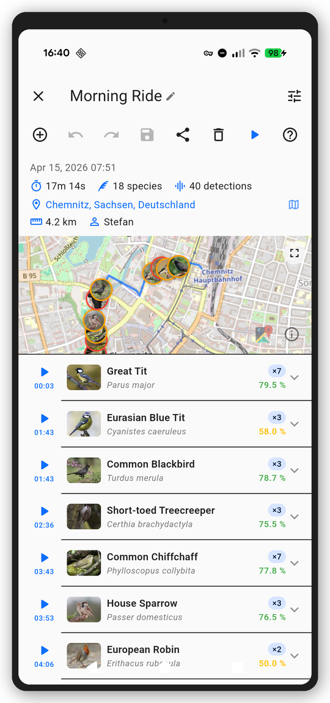

# BirdNET Live

<p align="center">
  
</p>

<p align="center">
  <a href="LICENSE"></a>
  
  
  
  
</p>

The bioacoustics companion app for field researchers, conservationists, and birders. Identifies bird species in real time using on-device BirdNET+ inference — no internet required. Built with Flutter for Android, iOS, and Windows.

<p align="center">
  
  
  
  
  
</p>

<p align="center">
  <a href="https://github.com/birdnet-team/birdnet-live-app/releases/latest"><b>Download APK</b></a>
  &nbsp;·&nbsp;
  <a href="https://birdnet-team.github.io/birdnet-live-app/"><b>Documentation</b></a>
  &nbsp;·&nbsp;
  <a href="https://github.com/birdnet-team/birdnet-live-app/releases"><b>All Releases</b></a>
</p>

**NOTE: BirdNET Live is under active development. Some rough edges and limitations remain — please [report issues](https://github.com/birdnet-team/birdnet-live-app/issues) you run into and contribute if you can!**

---

## Features

- **Live Mode** — Real-time scrolling spectrogram with species identification
- **Point Count Mode** — Timed survey sessions with countdown timer and station metadata
- **Survey Mode** — Long-running transect surveys with GPS tracking, background monitoring, and detection sampling
- **File Analysis Mode** — Analyze existing audio files (WAV, FLAC, MP3, OGG, and more)
- **Explore** — Browse species expected at your location using the BirdNET geo-model
- **Session Library** — Review, edit, and export past sessions with audio playback
- **Export** — Raven Pro, CSV, JSON, GPX, and ZIP bundle formats
- **On-device inference** — BirdNET+ model (5,250 species), no internet required
- **FLAC recording** — Pure Dart encoder for compressed audio (50–60% reduction)
- **Landscape & tablet layouts** — Adaptive UI for phones and tablets in both orientations
- **Localization** — Full English and German UI

## Install on Android

BirdNET Live is available as a signed APK for sideloading. Download the latest release from the [Releases page](https://github.com/birdnet-team/birdnet-live-app/releases/latest), transfer the `.apk` file to your phone, and open it to install. You may need to allow installation from unknown sources in your device settings.

> **Note:** The APK is ~253 MB because it includes the full BirdNET+ audio model (~152 MB) for offline inference.

## Quick Start

### Prerequisites

- [Flutter SDK](https://flutter.dev/docs/get-started/install) (>= 3.0)
- [Android Studio](https://developer.android.com/studio) (for Android SDK & emulator)
- Xcode (macOS only, for iOS development)

### Setup

```bash
git clone https://github.com/birdnet-team/birdnet-live-app.git
cd birdnet-live-app
flutter pub get
flutter gen-l10n
```

### Verify

```bash
flutter doctor    # Check Flutter setup
flutter test      # Run tests
flutter analyze   # Check for issues
```

## Deploy to Phone

### Android (USB — Windows / macOS / Linux)

1. **Enable Developer Options** on your phone: Settings → About phone → tap "Build number" 7 times.
2. **Enable USB debugging**: Settings → Developer options → USB debugging → On.
3. **Connect** phone via USB and accept the debugging prompt.
4. **Check** Flutter sees the device:
   ```bash
   flutter devices
   ```
5. **Run** (debug mode with hot reload):
   ```bash
   flutter run
   ```
   Or press `F5` in VS Code with the Flutter extension installed.

6. **Build release APK** (optional):
   ```bash
   flutter build apk --release
   ```
   The APK will be at `build/app/outputs/flutter-apk/app-release.apk`. Transfer it to your phone and install.

### Android (Wireless — Windows)

1. Complete steps 1–3 above (USB debugging on, phone connected via USB).
2. **Pair** over Wi-Fi (Android 11+):
   ```bash
   # On the phone: Developer options → Wireless debugging → Pair device with pairing code
   # Note the IP:port and pairing code shown
   adb pair <ip>:<port>
   # Enter the pairing code when prompted
   ```
3. **Connect** wirelessly:
   ```bash
   adb connect <ip>:<port>
   # Use the port shown under "Wireless debugging" (not the pairing port)
   ```
4. **Unplug** the USB cable. Run as usual:
   ```bash
   flutter run
   ```

### iOS (macOS only)

1. **Connect** iPhone via USB.
2. **Trust** the computer on the phone when prompted.
3. **Open** `ios/Runner.xcworkspace` in Xcode and set your signing team under Signing & Capabilities.
4. **Run**:
   ```bash
   flutter run
   ```
   Or press `F5` in VS Code.

### VS Code Tips

- Install the **Flutter** and **Dart** extensions.
- Select your target device in the status bar (bottom-right).
- `F5` to launch with debugger attached.
- `Ctrl+F5` to launch without debugger (faster startup).
- Use the hot reload button (⚡) or `r` in the terminal for quick iterations.
- `R` in the terminal for hot restart (resets state).

## Documentation

- **User & Developer Docs**: [GitHub Pages](https://birdnet-team.github.io/birdnet-live-app/) (MkDocs Material)

To preview the documentation locally:

```bash
pip install mkdocs mkdocs-material mkdocs-static-i18n pymdown-extensions
mkdocs serve
```

Then open [http://127.0.0.1:8000](http://127.0.0.1:8000) in your browser.

## Project Structure

```
lib/
  core/           # Constants, theme, utilities, extensions
  features/       # Feature modules (live, point_count, survey, file_analysis,
                  #   audio, inference, explore, history, settings, home, about)
  l10n/           # Localization ARB files (en, de)
  shared/         # Shared models, providers, services, widgets
                  #   (e.g. ContentWidthConstraint for tablet max-width)

docs/             # MkDocs source for GitHub Pages documentation
assets/           # App assets (models, species data, images, fonts)
test/             # Tests mirroring lib/ structure
```

## Development

```bash
flutter run          # Run with hot reload
flutter test         # Run tests
flutter analyze      # Static analysis
dart format .        # Format code
```

See [CONTRIBUTING.md](CONTRIBUTING.md) for guidelines.

## License

- **Source Code**: The source code for this project is licensed under the [MIT License](https://opensource.org/licenses/MIT).
- **Models**: The models used in this project are licensed under the [Creative Commons Attribution-ShareAlike 4.0 International License (CC BY-SA 4.0)](https://creativecommons.org/licenses/by-sa/4.0/).

Please ensure you review and adhere to the specific license terms provided with each model.

## Terms of Use

Please refer to the [TERMS OF USE](TERMS_OF_USE.md) file for detailed terms and conditions regarding the use of the BirdNET+ V3.0 preview models.

## Funding

Our work in the Cornell K. Lisa Yang Center for Conservation Bioacoustics is made possible by the generosity of K. Lisa Yang to advance innovative conservation technologies to inspire and inform the conservation of wildlife and habitats.

The development of BirdNET is supported by the German Federal Ministry of Research, Technology and Space (FKZ 01|S22072), the German Federal Ministry for the Environment, Climate Action, Nature Conservation and Nuclear Safety (FKZ 67KI31040E), the German Federal Ministry of Economic Affairs and Energy (FKZ 16KN095550), the Deutsche Bundesstiftung Umwelt (project 39263/01) and the European Social Fund.

## Partners

BirdNET is a joint effort of partners from academia and industry.
Without these partnerships, this project would not have been possible.
Thank you!

