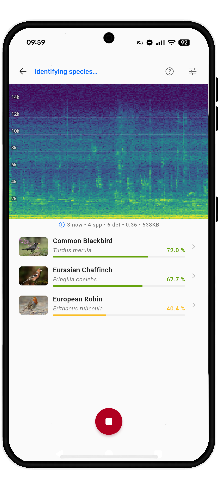
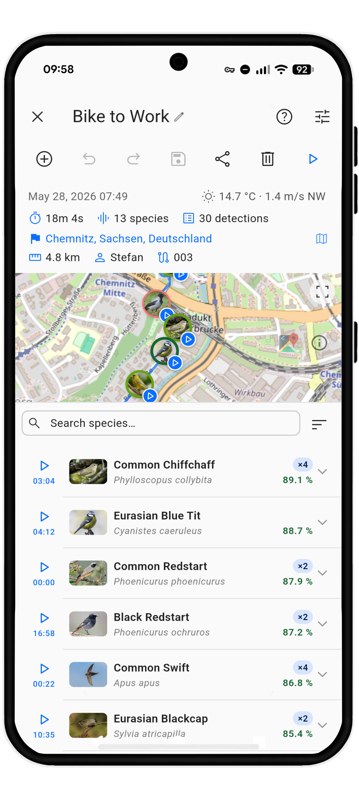
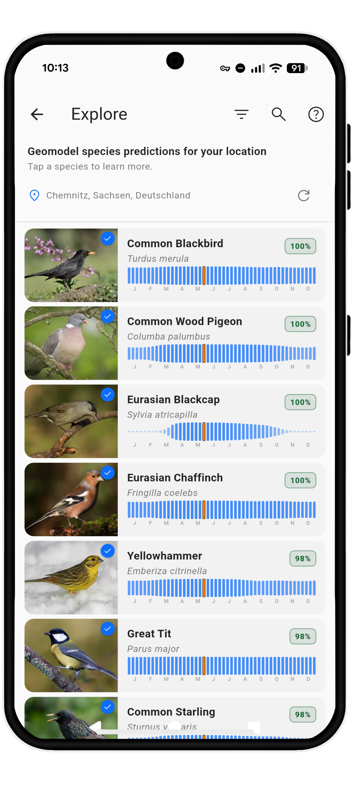
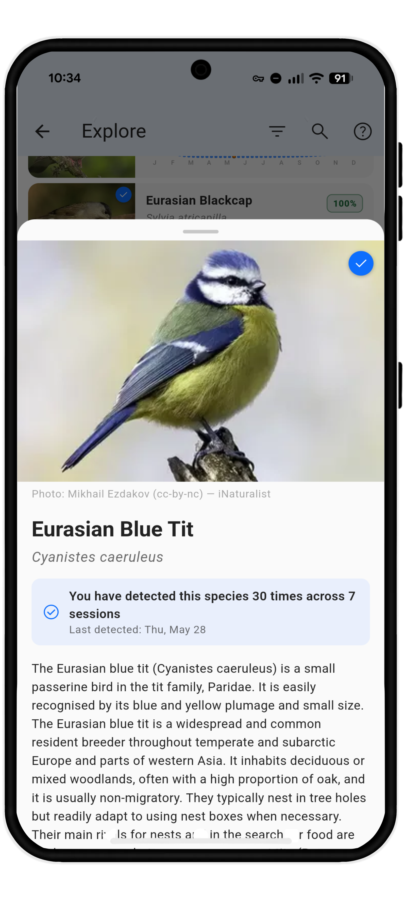
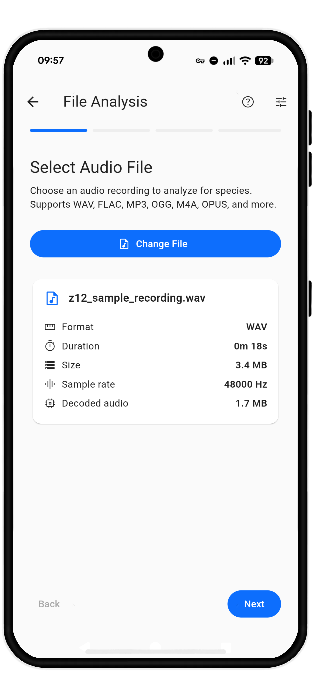

# BirdNET Live

**Professional bioacoustics in your pocket.**

BirdNET Live is a Flutter app built for field researchers, conservationists, and birders who need dependable acoustic evidence in the field. It runs the BirdNET+ audio classifier and geo-model directly on your device, so species identification works offline after installation.

  
  
  

## Features

- **Live Mode** - Real-time scrolling spectrogram with species identification
- **Point Count Mode** - Timed survey sessions with countdown timer and station metadata
- **Survey Mode** - Long-running transect surveys with GPS tracking, background monitoring, and detection sampling
- **File Analysis Mode** - Offline analysis of existing recordings (WAV, FLAC, MP3, OGG, and more)
- **Explore** - Browse species expected at your location using the BirdNET geo-model
- **Session Library** - Review, edit, and export past sessions with audio playback
- **Export** - Raven Pro, CSV, JSON, GPX, and ZIP bundle formats with provenance metadata
- **On-device inference** - BirdNET+ model coverage for 5,250 species, no internet required
- **FLAC recording** - Compressed audio capture with smaller files for long surveys
- **Accessibility** - Screen-reader labels, tooltips, and optional spoken detection announcements
- **Responsive layouts** - Adaptive phone, tablet, portrait, and landscape interfaces

  
  
  
  
  

  <a href="https://play.google.com/store/apps/details?id=de.tu_chemnitz.mi.kahst.birdnet_live"><b>Google Play</b></a>
  &nbsp;·&nbsp;
  <a href="https://github.com/birdnet-team/birdnet-live-app/releases/latest"><b>Download APK</b></a>
  &nbsp;·&nbsp;
  <a href="https://github.com/birdnet-team/birdnet-live-app"><b>GitHub</b></a>
  &nbsp;·&nbsp;
  <a href="https://github.com/birdnet-team/birdnet-live-app/releases"><b>All Releases</b></a>

## Quick Start

See the [User Guide](user/index.md) for an overview, then open [Getting Started](user/getting-started.md) to install and run BirdNET Live.

## Install on Android

BirdNET Live is available as a signed APK for sideloading. Download the latest release from the [GitHub Releases page](https://github.com/birdnet-team/birdnet-live-app/releases/latest), transfer the `.apk` file to your phone, and open it to install. You may need to allow installation from unknown sources in your device settings.

> **Note:** The APK is ~253 MB because it includes the BirdNET+ model assets for offline inference.

## For Developers

Check the [Developer Guide](developer/index.md) for architecture, building, and contributing.

## License

BirdNET Live is open source under the [MIT License](https://github.com/birdnet-team/birdnet-live-app/blob/main/LICENSE).
